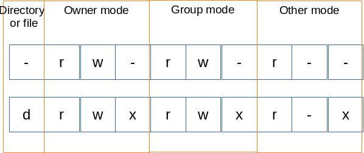

# Basic Shell


## [Quoting](https://www.gnu.org/software/bash/manual/html_node/Quoting.html)

'' inhibit all interpretation of a sequence of characters.

"" suppress most of the interpretation of a sequence of characters. Exceptions like !, \ , $.


```shell
echo '#!/bin/sh' > semester
```
Double-quoted will not work here because of special meaning of !.

## Access modes

```shell
❯ ls -l
total 8
-rw-rw-r-- 1 bingzho rdaff   61 Feb  2 11:06 semester
drwxrwxr-x 2 bingzho rdaff 4096 Feb  2 11:12 tmp
```


## Print last modified date

```
stat -c %y semester > last-modified.txt
```

### Lists files

```
ls -aht --color=auto
```
List files with all hidden files, in human readable format, ordered by recency and colorized output.

### Shell function

`marco` current working directory should be saved
```
marco(){
	export last_path=$(pwd)
}
```

`polo` `cd` back to the directory where you executed marco
```
polo(){
    if [[ -n $last_path ]] 
    then
        cd $last_path
    else
    echo "marco is not called yet"
    fi
}
```

### Debugger

Run `test.sh` and log stdout and stderr to file `log`. Stop when error happens and print log.
Note: `2>>` is error stream.

```
#!/bin/bash
 
while true
do
    ./test.sh >> log 2>> log
    if [[ $? -ne 0 ]]
    then
        cat log
        break
    fi
done
```


---
Ref: https://missing.csail.mit.edu/2020/course-shell/